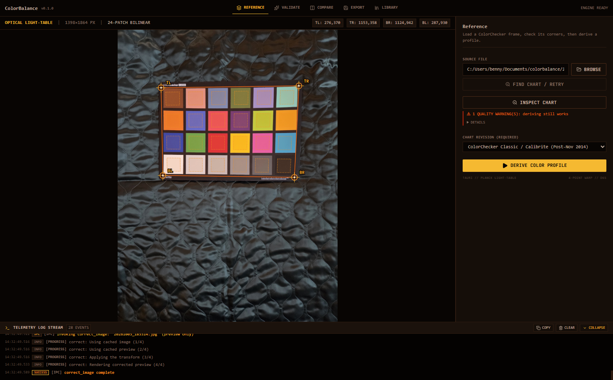
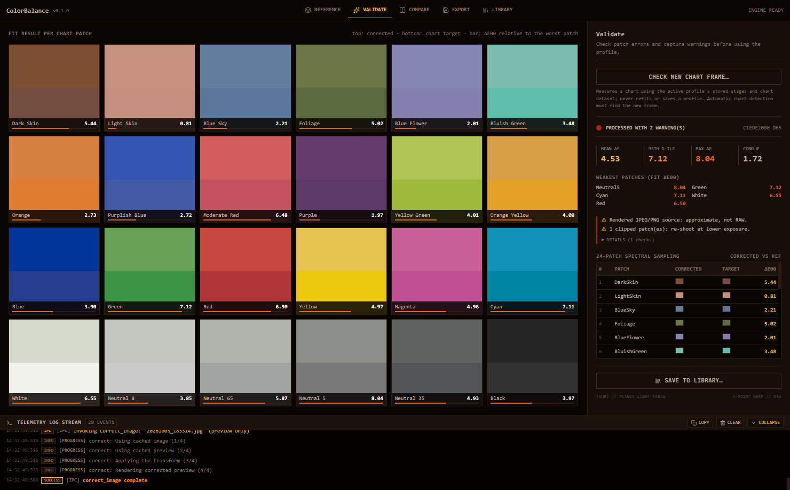
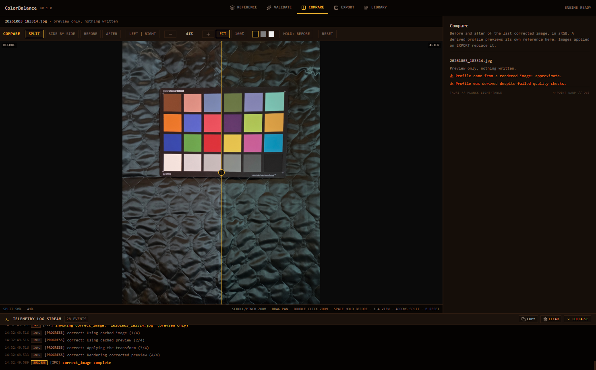
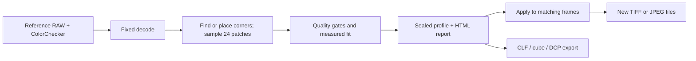

# ColorBalance

**Make a measured color transform from one ColorChecker frame, then use it on the rest of the shoot.** A local desktop app and a CLI share the same Rust color engine. No account, upload, or subscription.

[](https://github.com/benkl/colorbalance/actions/workflows/ci.yml) [](https://github.com/benkl/colorbalance/releases) [](#license)

> **0.1.0 pre-release.** Windows x64 binaries are unsigned and have not been checked on a clean machine. Other cameras' RAW formats are not yet verified. Keep the original files.

## See it work

| Place the chart | Check the fit |
| --- | --- |
|  |  |



The screenshots show the real desktop app running against the tracked sample JPEG in **quick-and-dirty** mode. That mode is approximate, not a substitute for a RAW reference. The image and chart are a capture from this repository, not stock art.

## What it does



- **Inspect before deriving.** The desktop finds the chart or leaves the corners for manual placement. You choose the *physical* chart revision; the detector never guesses it. Inspect flags RAW photosite clipping, undersized patches and uneven patches.
- **One fit, repeatable apply.** Core fits an exposure scalar, channel scaling and a 3×3 matrix. Apply uses the stored values, not white balance or brightness inferred from each scene. The profile pins camera identity and decode settings. Mismatches stop by default; overrides are recorded.
- **Don't touch originals.** Output goes to a new path through a temporary file in the destination directory, then an atomic rename. Existing output is skipped or refused without explicit overwrite. Batch work is bounded and cancellable.
- **Choose an output.** 16-bit TIFF or 8-bit JPEG, sRGB / Display P3 / Adobe RGB (1998) with matching embedded ICC. CLF and `.cube` expect normalized linear camera RGB from the pinned decode contract—not finished sRGB images. A matrix-only `.dcp` targets Lightroom / Camera Raw **RAW** processing; [it has not been round-tripped in Lightroom](docs/LIGHTROOM_EXPORT_PLAN.md).

## Get it

**Windows x64:** download `colorbalance-desktop-windows-x64.exe` from [Releases](https://github.com/benkl/colorbalance/releases), verify it against `SHA256SUMS.txt`, then run it. Windows may warn because the file is not signed. WebView2 is required (usually already installed on Windows 10/11). The release also contains `colorbalance-cli-windows-x64.exe`.

No installers or macOS/Linux binaries are published. Build from source on those systems; compilation is exercised by CI, but packaged desktop builds are not. [Build and packaging notes](docs/packaging.md).

### First calibration

1. Photograph a ColorChecker Classic under the same camera, light and exposure as your batch. Prefer a RAW reference. Avoid clipping and glare; make each patch large enough to sample cleanly.
2. Drop the reference into the desktop app. Check or drag the four corners. Select the **physical chart revision**, then INSPECT CHART.
3. Read the gate failures before DERIVE COLOR PROFILE. If you override a failure, the profile records it; the color may still be wrong.
4. Choose an image or a folder on EXPORT, choose a separate destination, and apply. Use COMPARE and the HTML report to judge the result—not just the fit's mean ΔE.

The CLI does not run the chart detector. Pass `--quad` (TL, TR, BR, BL in image pixels), or omit it only when the chart fills the 8%-inset sampling rectangle.

```bash
cargo build --release -p colorbalance-cli
./target/release/colorbalance inspect reference.dng --chart classic-from-nov-2014 --quad x1,y1,x2,y2,x3,y3,x4,y4
./target/release/colorbalance derive reference.dng --chart classic-from-nov-2014 --quad x1,y1,x2,y2,x3,y3,x4,y4 --profile look.cbprofile.json --report look.html
./target/release/colorbalance apply look.cbprofile.json ./batch --output ./out
./target/release/colorbalance export look.cbprofile.json --format dcp --camera-name "Your camera name" -o look.dcp
```

On Windows, use `target\release\colorbalance.exe`. For a JPEG/PNG reference add `--quick-and-dirty` to `derive`; such a profile cannot export a DCP. `colorbalance <command> --help` gives the full option list. [Capture guide and interoperability details](docs/USAGE.md).

## Reality check

| Area | What is verified | What is not |
| --- | --- | --- |
| RAW decoding | Synthetic DNGs and one Samsung Galaxy S25 LinearRaw DNG (D23); rawler + this project's AHD | Other real-camera formats; a larger fixture collection |
| Rendered JPEG/PNG | Quick-and-dirty derivation and batch application, clearly flagged | A physically accurate calibration from camera-processed pixels |
| Desktop | Reference → inspect → derive → compare and export exercised on Windows; backend and frontend tests | Signed installers or clean-machine verification |
| DCP | Independent reader parses real exports and checks the matrices | Lightroom / Camera Raw acceptance or visual parity; [round-trip plan](docs/LIGHTROOM_EXPORT_PLAN.md) |
| Web | Core builds for `wasm32-unknown-unknown` in CI | Browser app, bindings, decode parity, hosted mode (issues #21–25) |

Milestones 1–4 have closed issues; [milestone 5](https://github.com/benkl/colorbalance/milestone/5) tracks web feasibility. Chart detection is desktop-only. Quality thresholds and exact scopes are in [the implementation plan](docs/IMPLEMENTATION_PLAN.md).

## Build and contribute

Rust 1.89+; the desktop also needs Node.js 20+ and platform Tauri prerequisites.

```bash
cargo fmt --all --check
cargo clippy --workspace --all-targets -- -D warnings
cargo test --workspace
cargo build -p colorbalance-core --target wasm32-unknown-unknown

cd apps/desktop/frontend && npm ci && npm run build && npm test
cd ../src-tauri && cargo run
```

The desktop backend is a separate Cargo workspace. See [development](docs/development.md) for its gates, [architecture](docs/ARCHITECTURE.md) for decisions, [AGENTS.md](AGENTS.md) for invariants, and [release notes](CHANGELOG.md). The Python code under `research/` generates independent fixtures; it is never used at runtime.

## License

ColorBalance's own code is [MIT](LICENSE-MIT) **OR** [Apache-2.0](LICENSE-APACHE), at your choice. Its binaries include independently licensed dependencies, notably [`rawler` under LGPL-2.1](THIRD_PARTY_NOTICES.md). See [third-party notices](THIRD_PARTY_NOTICES.md) before redistributing binaries.

ColorChecker is a trademark of X-Rite / Calibrite; Lightroom and Camera Raw are Adobe trademarks. This project is not affiliated with them.
